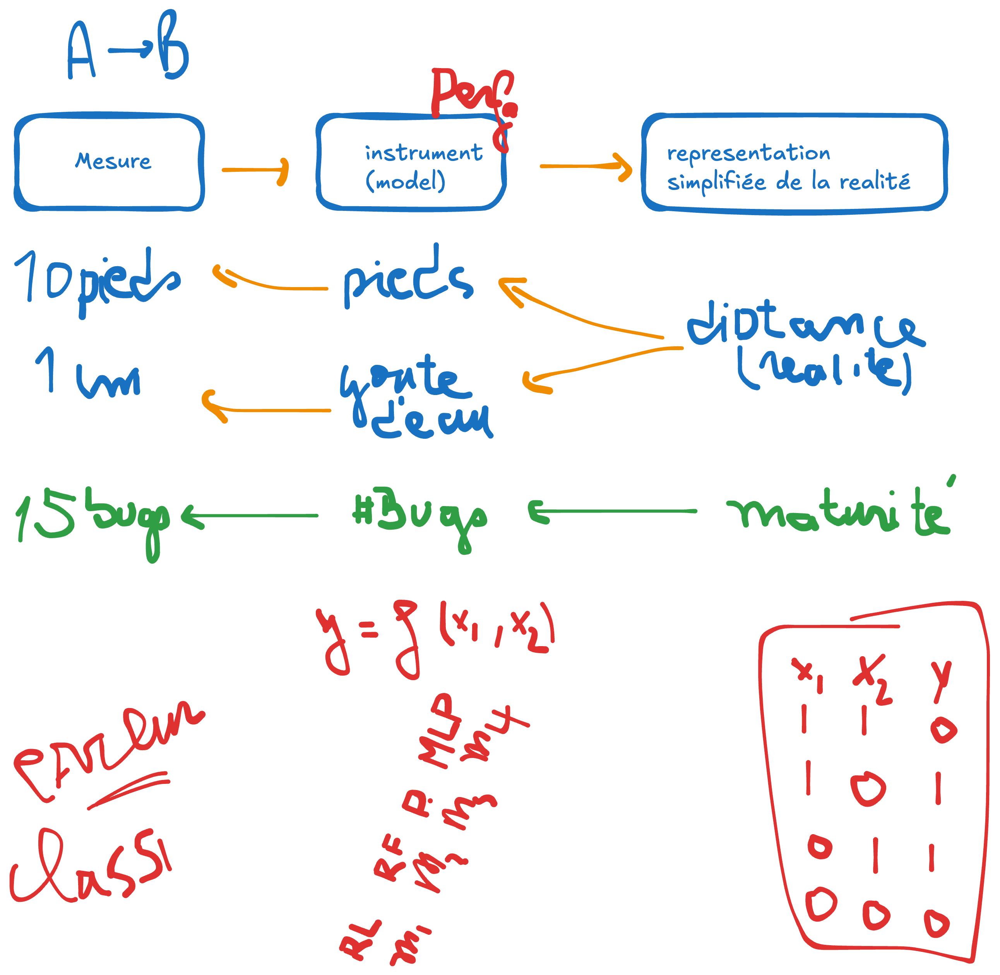
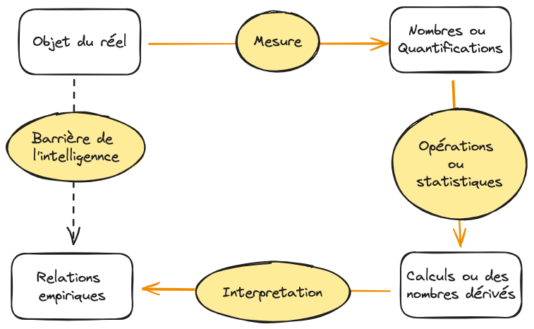
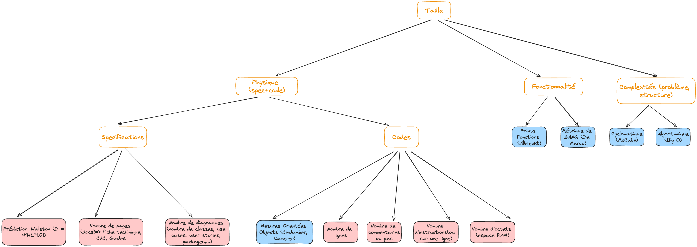
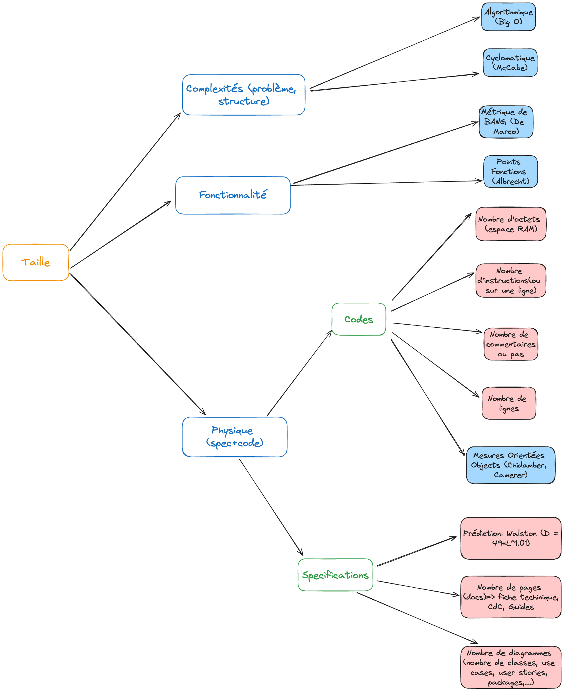

.. _part2_chap3:

***********************************************************************
Chapitre 3 : Les modèles et les mesures
***********************************************************************

Pour évaluer la qualité sans subjectivité, il faut **mesurer**. Ce chapitre pose
la théorie de la mesure (mesure, modèle, échelle) et son application à l'AQL.

Objectifs
=========

À la fin de ce chapitre, vous devez pouvoir :

- Expliquer pourquoi on mesure en AQL
- Distinguer **mesure** et **calcul**, et la notion de **modèle**
- Identifier le **type d'échelle** d'une mesure
- Distinguer les métriques **internes** et **externes** de la qualité

Pourquoi les mesures en AQL ?
=============================

- **Éviter la subjectivité** dans l'évaluation des critères. Dire « mon logiciel
  est *mature (fiable)* » ne veut rien dire tant qu'on ne sait pas comment le
  comprendre ni si deux personnes parlent de la même chose.
- **Quantifier ou évaluer** un critère/sous-critère : lui donner une valeur, une
  échelle, une référence.

.. code-block:: text

   « Mon logiciel est mature » ⇒ on mesure la fréquence de bugs par mois :
       si #bugs < 2 bugs/mois  alors  mature
       sinon                          immature

Ou en pourcentage :

.. math::

   \text{maturité} = 1 - \frac{\text{nombre de bugs}}{\text{nombre d'utilisations}}

Mesure ?
========

- **Mesure = quantification** : donner une valeur à quelque chose dans une unité
  donnée (poids, distance, durée, …). Une mesure a une **unité** de référence
  (unités internationales : m, kg, … ; multiples / sous-multiples).
- **Mesure vs calcul** :

  - **Mesure** = quantification **directe** (ex. cm) ;
  - **Calcul** = quantification **indirecte**, obtenue à partir de mesures (ex. 1 m = 100 cm).

De la réalité à la mesure
=========================

Pour obtenir une mesure (la quantification d'une réalité), il faut passer par un
**modèle** (un instrument).

   On n'accède pas directement à la réalité : on passe par un modèle (instrument).

Exemples :

- mesurer une **distance** → le modèle est la règle graduée qui donne des centimètres ;
- mesurer la **maturité** → le modèle est le comptage qui donne un nombre de bugs/mois.

L'approche de la mesure
=======================

Plutôt que de déduire directement les relations entre objets (souvent impossible),
on passe par un **modèle → mesure → calculs → interprétation** pour retrouver les
**relations empiriques** qui lient les objets.

   L'approche de la mesure : modèle, mesure, calcul, interprétation.

Comment valider un modèle ?
---------------------------

On valide un modèle par l'**expérimentation** : le meilleur modèle est le plus
**fidèle** à la réalité (celui qui préserve le mieux la relation entre réalité et
représentation).

- Validation ⇒ **performance** (évaluer chaque modèle par rapport à la réalité) ;
- performance ⇒ **expérimentation** (collecter des données réelles et des mesures,
  puis confronter les deux).

Échelle d'une mesure
====================

**Échelle = modèle + système de relation empirique.** On distingue cinq types :

.. list-table::
   :header-rows: 1
   :widths: 18 42 40

   * - Type d'échelle
     - Définition
     - Exemples
   * - **Nominale**
     - Classification par attribution de noms
     - Masculin/féminin ; mature/pas mature ; vert/jaune/rouge
   * - **Ordinale**
     - Noms **dont l'ordre importe** (mutuellement exclusif, conjointement exhaustif)
     - Mentions (TB, B, AB, P, …)
   * - **Intervalle**
     - Classification répartie en distances basées sur des valeurs
     - Mentions par intervalles (< 4 ; 4 ≤ x ≤ 8 ; > 8)
   * - **Ratio**
     - Nombre relatif à une référence (probabilité, pourcentage)
     - Zéro absolu (Kelvin) ; 80 % sûr, 60 % mature
   * - **Absolue**
     - Le nombre lui-même
     - Nombre de bugs, de fautes, de lignes, de classes…

Les métriques de qualité : vues interne et externe
===================================================

Mesurer la qualité porte sur **deux points de vue**.

1. **Point de vue interne** — spécification, conception, code et tests. Une bonne
   **structure interne** ⇒ une bonne qualité du produit-logiciel. Agir *en amont*
   sur la structure pour contrôler la qualité : c'est le cœur de l'**assurabilité**.
2. **Point de vue externe** — les attributs observables, par artefact :

.. list-table::
   :header-rows: 1
   :widths: 22 78

   * - Artefact
     - Attributs (exemples)
   * - **Spécifications**
     - Taille (nombre de fonctionnalités, de specs non fonctionnelles), réutilisation, redondance (autres façons de faire : raccourcis, menu contextuel…), modularité, fonctionnalité
   * - **Conception**
     - Taille, réutilisation, modularité, **couplage**, **cohésion**, fonctionnalité
   * - **Code**
     - Taille, réutilisation, modularité, **couplage**, **cohésion**, fonctionnalité, **complexités** (cyclomatique, Big O…), structure du flot de contrôle
   * - **Test**
     - Couverture, taille

   Les attributs mesurables selon l'artefact (spécifications, conception, code, test).

   Agir sur la structure interne pour contrôler la qualité externe du produit.

Les chapitres suivants détaillent les familles de métriques :
:doc:`McCabe & Big O <chap4>`, :doc:`Point Fonction & Bang <chap5>`,
:doc:`métriques OO <chap6>` et :doc:`cohésion & couplage <chap7>`.

Exercice
========

Pour le sous-critère **maturité** d'une application que vous connaissez, proposez :
un **modèle**, le **type d'échelle**, et une **mesure** chiffrée (ex. ``1 − #bugs/#usages``
sur 5 ans ⇒ 70 %, échelle *ratio*).
