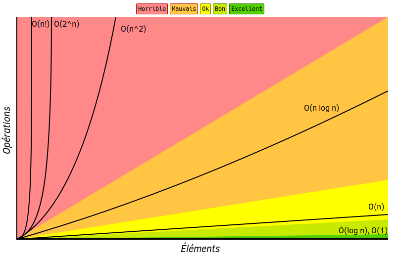
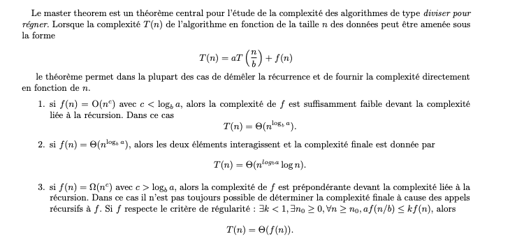

.. _part2_chap4:

***********************************************************************
Chapitre 4 : Complexité — McCabe & Big O
***********************************************************************

Deux métriques pour évaluer la **complexité du code** : la complexité
**cyclomatique de McCabe** (structure du flot de contrôle) et la notation
**Big O** (croissance du temps/mémoire).

.. note::
   Chapitre présenté en **exposé** : décrire la métrique, montrer les calculs,
   relier aux critères ISO/IEC 9126, puis discuter avantages/limites.

La complexité cyclomatique de McCabe
====================================

Développée par Thomas J. McCabe, elle indique la **complexité structurelle** d'un
programme. Elle se calcule en comptant le nombre de **chemins linéairement
indépendants** dans le graphe de flot de contrôle (formé par les boucles,
conditions, branchements). Il existe deux approches :

.. list-table::
   :header-rows: 1
   :widths: 16 42 42

   * -
     - Graphique
     - Décision
   * - Avantage
     - Donne le détail de la structure du code (CFG)
     - Rapide
   * - Limite
     - Laborieux
     - Pas de vision globale de la structure

Formule graphique
-----------------

.. math::

   M = E - N + 2P

où :math:`M` = complexité cyclomatique, :math:`E` = nombre d'arêtes,
:math:`N` = nombre de nœuds, :math:`P` = nombre de composantes connexes.

.. note::
   Pour un seul programme (ou sous-programme / méthode), :math:`P = 1`.

Catégories de risque (McCabe)
-----------------------------

Une complexité plus élevée = plus de difficultés de test et de maintenance. McCabe
propose un maximum de **10** par fonction :

.. list-table::
   :header-rows: 1
   :widths: 20 80

   * - M
     - Interprétation
   * - **1 – 10**
     - Procédure simple, peu de risque
   * - **11 – 20**
     - Plus complexe, risque modéré
   * - **21 – 50**
     - Complexe, risque élevé
   * - **> 50**
     - Code non testable, risque très élevé

Approche par décisions (*cheat sheet*)
--------------------------------------

.. list-table::
   :header-rows: 1
   :widths: 45 30 25

   * - Ajouter **+1**
     - Ajouter **+0**
     - Commentaire
   * - ``if``, ``elif``, ``while``, ``for``, ``do/while``, ``?:``
     - ``else``
     -
   * - ``switch`` (chaque ``case``)
     - ``default``
     -
   * - ``catch`` / ``except``
     - ``finally``
     -
   * - chaque opérateur booléen (``&&``, ``||``, ``and``, ``or``) dans un ``if``/``elif``
     -
     - Dans le McCabe original, tout le contenu du ``if`` compte pour **un seul** point de décision
   * - ``Function``, ``class`` (dans la globalité)
     - ``return``, ``break``, ``continue``
     -

La complexité Big O
===================

La notation **Grand O** décrit le **temps d'exécution** (ou l'usage mémoire) d'un
algorithme : elle juge l'**efficacité** d'un code en mesurant la croissance
relative du temps par rapport à la taille des données d'entrée, à grande échelle.

   Les classes de complexité usuelles.

   Croissance comparée : O(1), O(log n), O(n), O(n log n), O(n²), …

.. admonition:: Lien avec ISO/IEC 9126
   :class: tip

   McCabe relève surtout de la **maintenabilité** (analyse, testabilité) ; Big O
   relève du **rendement** (rapidité, ressources).

Exercice
========

Soit l'algorithme **MergeSort** (tri fusion) en Python (fonctions ``merge`` et
``mergeSort``) :

1. Calculez la complexité de **McCabe** de chaque fonction, puis de l'ensemble (mode graphique). Analysez les résultats.
2. Calculez la complexité **Big O** de chaque fonction, puis de l'ensemble. Analysez les résultats.
