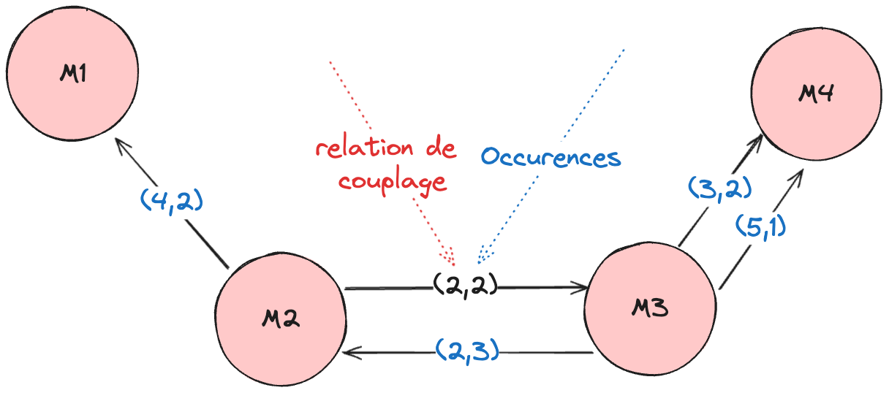

.. _part2_chap7:

***********************************************************************
Chapitre 7 : Cohésion & couplage
***********************************************************************

Deux propriétés structurelles fondamentales : la **cohésion** (à l'intérieur d'un
module) et le **couplage** (entre modules). La règle d'or : **forte cohésion,
faible couplage**.

.. note::
   Chapitre présenté en **exposé**.

La cohésion
===========

La **cohésion** mesure à quel point les éléments d'un module (classe, composant)
sont **liés entre eux**. Une **cohésion élevée** est préférable : le module est
bien défini et ne fait *qu'une seule chose*. Elle favorise la **maintenabilité**,
la **compréhension** et la **réutilisation**.

**LCOM (Lack of Cohesion in Methods)**
  Mesure le **manque** de cohésion : le nombre de paires de méthodes qui ne
  partagent **pas** de variables/attributs.

  - **LCOM = 0** — meilleur cas (toutes les méthodes partagent des attributs) ;
  - **LCOM = 1** — bon (perte minimale de cohésion) ;
  - **LCOM > 1** — mauvaise pratique : la classe pourrait être scindée en classes
    plus petites et plus cohésives.

**Cohésion de causalité**
  Degré d'interdépendance entre les fonctions d'un module liées par une **cause
  commune** (même tâche/objectif). Élevée ⇒ plus facile à comprendre et maintenir.

  .. math::

     \text{cohésion de causalité} = \frac{\text{relations de cause à effet entre fonctions}}{\text{relations totales entre fonctions}}

Le couplage
===========

Le **couplage** mesure l'interdépendance entre modules/classes/composants. Un
**faible couplage** est préférable : un module indépendant peut être modifié sans
affecter le reste. Il favorise la **flexibilité**, la **réutilisation**, la
**maintenance** et la **testabilité**.

**CBO (Coupling Between Objects)**
  Nombre de classes dont dépend directement une classe donnée. Démarche : identifier
  les classes → analyser les dépendances (références, appels) → compter, pour chaque
  classe, le nombre de classes directement liées. Plus le CBO est élevé, plus le
  couplage est fort (conception moins modulaire).

**Couplage entre modules**
  Évalue la dépendance entre méthodes/modules (nombre de méthodes d'une classe
  appelées par d'autres). Un couplage élevé ⇒ complexité et interactions accrues.

Graphe de couplage
------------------

Pour quantifier le couplage entre modules, on construit d'abord le **graphe de
couplage des modules**, puis on applique :

.. math::

   c(x, y) = i + \frac{n}{n+1}

où :math:`i` est la **pire relation de couplage** et :math:`n` le **nombre
d'interconnexions** entre :math:`x` et :math:`y`.

   Le graphe de couplage entre modules.

.. admonition:: Exemple
   :class: tip

   .. math::

      c(M_3, M_4) = 5 + \tfrac{3}{3+1} = 5{,}75 \qquad
      c(M_2, M_3) = 2 + \tfrac{5}{5+1} = 2{,}83 \qquad
      c(M_1, M_2) = 4 + \tfrac{2}{2+1} = 4{,}67

Pourquoi ces métriques sont importantes
=======================================

- Évaluer la **qualité** d'un logiciel ;
- **identifier** des problèmes potentiels ;
- **guider** la conception et le développement ;
- **quantifier** des concepts abstraits (qualité de l'architecture, maintenabilité,
  flexibilité, réutilisabilité).

.. admonition:: Lien avec ISO/IEC 9126
   :class: tip

   Forte cohésion + faible couplage ⇒ **maintenabilité** (analyse, modification,
   stabilité, **testabilité**) et **portabilité** accrues.

Exercice
========

Pour une petite application de votre choix (3–5 classes) : tracez le **graphe de
couplage**, calculez ``c(x, y)`` pour deux paires de modules, et estimez le **LCOM**
d'une classe. Proposez une amélioration (scinder, regrouper, abstraire).
